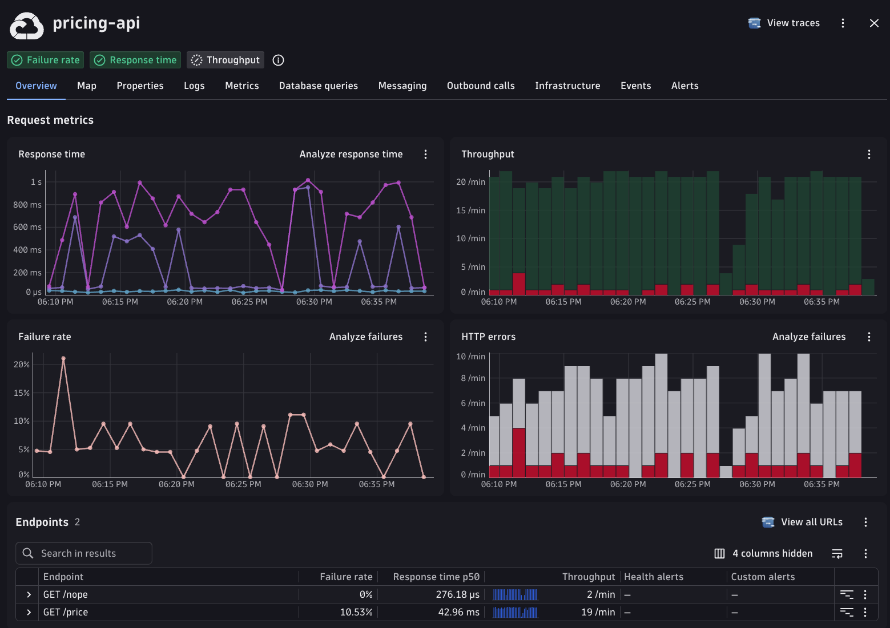
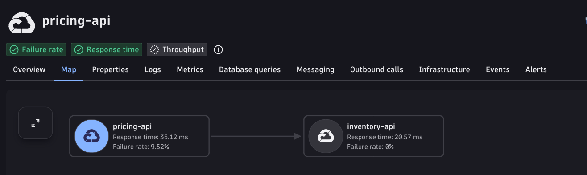
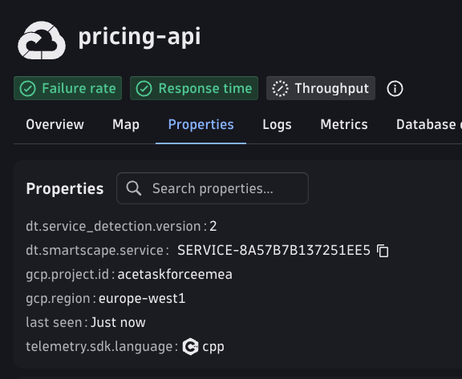

# C++ Zero-Code Instrumentation with OBI (eBPF)

Two native C++ services instrumented with **[OpenTelemetry eBPF Instrumentation
(OBI)](https://opentelemetry.io/docs/zero-code/obi/)**, exporting traces and RED
metrics to Dynatrace via OTLP/HTTP.

The point of this sample is what the C++ contains: **nothing**. No OpenTelemetry
SDK, no agent, no tracing library, no HTTP framework — just POSIX sockets and
one thread per connection. Grep the sources for `otel` or `trace` and you will
find only comments. OBI attaches eBPF probes to the socket syscalls from
*outside* the processes, so the telemetry appears without the binaries being
modified, recompiled, relinked or even restarted.

- `src/pricing-api.cpp` (port 8083) — `GET /price?item=widget&qty=3`, calls inventory-api
- `src/inventory-api.cpp` (port 8082) — `GET /check?item=widget&qty=3`

Both are instrumented, which is what gives you a real two-service topology in
Dynatrace rather than one service with an anonymous downstream.

## Requirements

OBI is eBPF, so this sample is **Linux only**:

| Requirement | Why |
|---|---|
| Linux kernel **5.8+** | eBPF features OBI relies on |
| **BTF** (`/sys/kernel/btf/vmlinux`) | without it the probes cannot load |
| **root** (or `CAP_BPF`, `CAP_PERFMON`, `CAP_NET_RAW`, `CAP_DAC_READ_SEARCH`) | attaching probes |
| `g++` with C++17, `make`, `curl` | building and fetching |
| `x86_64` or `arm64` | OBI release architectures |

Check all of it at once:

```bash
make check
```

Verified on Debian 12 (kernel 6.1) with OBI 0.12.2.

### Running on macOS

You cannot run this on macOS directly — there is no eBPF. Use a Linux VM and run
the sample inside it. With [Lima](https://lima-vm.io/):

```bash
limactl start --name obi template://debian-12
limactl shell obi
sudo apt-get update && sudo apt-get install -y g++ make curl
# then clone the repo inside the VM and continue below
```

A cloud VM works equally well. Docker Desktop is a poor fit: instrumenting
processes in *other* containers needs host PID namespace and privileged mode,
which defeats the simplicity this sample is demonstrating.

## Setup

```bash
cp .env.example .env
```

Edit `.env`:

| Variable | Description |
|---|---|
| `DT_API_URL` | OTLP endpoint, e.g. `https://<env-id>.live.dynatrace.com/api/v2/otlp` |
| `DT_API_TOKEN` | API token with `openTelemetryTrace.ingest` and `metrics.ingest` |
| `PRICING_PORT` | optional, default `8083` |
| `INVENTORY_PORT` | optional, default `8082` |

The token is never written into `obi-config.yaml` — it is passed to OBI as an
environment variable, so the generated config stays safe to read and share.

## Quick start

```bash
make check build install-obi config run   # build, fetch OBI, generate config, start services
make obi                                  # in a second terminal — needs sudo
```

`make run` starts both services plus a load generator in the background and logs
to `run/`. `make obi` runs OBI in the foreground so you can watch it attach:

```
msg="instrumenting process" cmd=.../bin/pricing-api   type=cpp service=pricing-api
msg="instrumenting process" cmd=.../bin/inventory-api type=cpp service=inventory-api
```

Both lines must appear. `type=cpp` is OBI recognising a native binary.

Stop with `make stop` (services) and Ctrl-C (OBI).

### All targets

| Target | Does |
|---|---|
| `make help` | list targets (the default) |
| `make check` | verify kernel, BTF, privileges, compiler |
| `make build` | compile both services into `bin/` |
| `make install-obi` | download OBI into `bin/` (~50 MB — it bundles its eBPF programs) |
| `make config` | generate `obi-config.yaml` from `.env` + the template |
| `make run` | start services + load generator |
| `make obi` | run OBI in the foreground |
| `make stop` | stop services + load generator |
| `make clean` | remove `bin/` and the generated config |

Override the OBI version or architecture:

```bash
make install-obi OBI_VERSION=0.12.2 OBI_ARCH=arm64
```

## What you get in Dynatrace

Under service namespace `cpp-obi-ebpf`:

- **Two services** — `pricing-api` and `inventory-api`, each becoming a `SERVICE` entity.
- **Distributed traces** spanning both processes:
  ```
  GET /price        pricing-api    (server span, root)
   └ GET /check     pricing-api    (client span)
      └ GET /check  inventory-api  (server span)
  ```
- **RED metrics** — `http.server.request.duration` and
  `http.client.request.duration`, split by `service.name`, `http.route` and
  `http.response.status_code`.

The load generator produces 200s, 409s (out of stock), 404s (a deliberate bad
route) and 500s (an injected pricing failure), so error rates are not flat zero.

> Note the semantic-convention dimension key is `http.response.status_code` —
> underscore between `status` and `code`. `http.response.status.code` silently
> matches nothing.

`pricing-api` with the usual RED charts, and both endpoints broken out — `GET
/price` carrying the injected failures and `GET /nope` the deliberate bad route:



Nothing here is specific to eBPF: the service looks and behaves exactly like one
reported by an SDK or OneAgent.

### Two services, not one

Because both binaries are instrumented, the service map shows the real call
direction rather than an anonymous downstream:



The `Properties` tab is where the instrumentation method shows through —
`telemetry.sdk.language: cpp` is OBI reporting a native binary, and it is the
quickest confirmation that the data really came from the eBPF probes:



### Why the trace spans two processes

`ebpf.context_propagation: all` in the config. Without it, pricing-api's client
span and inventory-api's server span land in two unrelated traces. OBI injects
and reads the `traceparent` header itself — neither C++ program knows the header
exists.

## Troubleshooting

**OBI starts, reports nothing.** Config keys are not validated. OBI accepts
unknown keys with no warning, no error and a clean startup — a typo is
indistinguishable from a working setting. Do not trust the config; confirm the
`instrumenting process` lines appear for both binaries. If they do not, check
that `exe_path` in `obi-config.yaml` is the correct **absolute** path (`make
config` fills it in for you).

**Everything looks healthy but no data in Dynatrace.** Two traps:

1. **OBI logs upload failures at `level=INFO`** — not WARN, not ERROR. Grepping
   for the usual severities finds nothing while no data leaves the host. Match on
   the message text:
   ```bash
   make obi 2>&1 | grep -iE 'failed to upload|failed to send'
   ```
2. **`endpoint` is used verbatim.** Unlike the base `OTEL_EXPORTER_OTLP_ENDPOINT`
   convention, OBI does *not* append the signal path. Both exporters must carry
   it in full — `.../api/v2/otlp/v1/traces` and `.../api/v2/otlp/v1/metrics`.
   Pointing them at a bare `.../api/v2/otlp` returns `404 Not Found` on every
   export. `make config` handles this; if you hand-edit, keep the paths.

**Is OBI even generating data?** It exposes its own metrics on
`127.0.0.1:8999`, which answers that without involving the tenant:

```bash
curl -s http://127.0.0.1:8999/metrics | grep 'service_name="pricing-api"' | head
```

Present locally but missing in Dynatrace means the fault is the export, not the
instrumentation. That split is what isolates the two traps above.

**Checking a config change quickly.** Add `trace_printer: text` to
`obi-config.yaml` and restart OBI to print every span to stdout — no tenant
round-trip needed.

**`make obi` exits immediately.** Usually missing privileges, missing BTF, or a
second OBI already running (only one instance can own the probes for a given
process). Run `make check`.

## Files

```
Makefile                    build, fetch, configure, run
.env.example                tenant URL + token
obi-config.yaml.template    OBI config; make config fills in the placeholders
src/pricing-api.cpp         C++17 HTTP server, calls inventory-api
src/inventory-api.cpp       C++17 HTTP server, the downstream
scripts/check-prereqs.sh    kernel / BTF / privilege preflight
scripts/install-obi.sh      download and unpack the OBI release
scripts/gen-config.sh       template -> obi-config.yaml
scripts/run-obi.sh          run OBI with credentials from .env
scripts/start_all.sh        start services + load generator
scripts/stop_all.sh         stop them
scripts/loadgen.sh          traffic against pricing-api
```

`bin/`, `run/` and the generated `obi-config.yaml` are gitignored.

## Running as a service

For anything longer-lived than a demo, run OBI under systemd rather than in the
foreground. Put the token in an `EnvironmentFile` with mode `0600` (not in the
YAML), and set `XDG_CACHE_HOME` — OBI needs a writable cache directory:

```ini
[Service]
ExecStart=/opt/obi/obi -config /etc/obi/config.yaml
EnvironmentFile=/etc/obi/obi.env     # OTEL_EXPORTER_OTLP_HEADERS=Authorization=Api-Token dt0c01...
Environment=XDG_CACHE_HOME=/var/cache/obi
Restart=always
User=root
```
