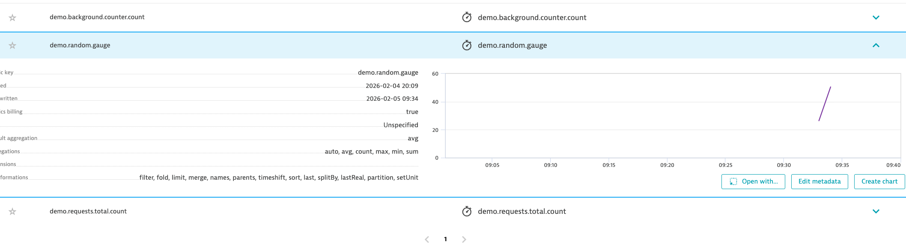

# Java Micrometer OTLP Metrics to Dynatrace

Spring Boot application that exports Micrometer metrics to Dynatrace via OTLP/HTTP with delta aggregation temporality.

## What it does

- Registers a custom counter (`demo.requests.total`) and a gauge (`demo.random.gauge`)
- A background scheduler bumps `demo.background.counter` every 5 seconds
- `/hello` endpoint increments the counter and is timed via `@Timed`
- Metrics are exported every 15s to `{DT_API_URL}/v1/metrics`

## Setup

```bash
cp .env.example .env
# Edit .env with your DT_API_URL and DT_API_TOKEN

./run.sh
```

Or manually:

```bash
export DT_API_URL="https://your-environment-id.live.dynatrace.com/api/v2/otlp"
export DT_API_TOKEN="dt0c01.your-token"
mvn spring-boot:run
```

## Load generator

```bash
./loadgen.sh http://localhost:8080/hello 60 4 40
```


