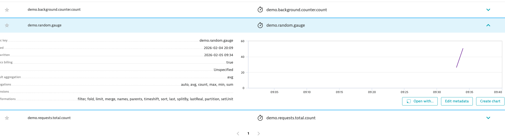

# Java Micrometer OTLP Metrics to Dynatrace

Spring Boot application that exports Micrometer metrics to Dynatrace via OTLP/HTTP with delta aggregation temporality.

## What it does

- Registers a custom counter (`demo.requests.total`) and a gauge (`demo.random.gauge`)
- A background scheduler bumps `demo.background.counter` every 5 seconds
- `/hello` endpoint increments the counter and is timed via `@Timed`
- Metrics are exported every 15s to `{DT_API_URL}/v1/metrics`
- OneAgent metadata is merged into the OTLP resource so the metrics attach to the right Dynatrace entities

`@Timed` needs two things that are **not** on by default in Spring Boot 4, both already configured
here: the `spring-boot-starter-aspectj` dependency (Boot's `TimedAspect` is
`@ConditionalOnClass(org.aspectj.weaver.Advice)`) and
`management.observations.annotations.enabled: true`. Without either, the annotation is silently
ignored and no timer is ever exported.

## Finding the metrics in Dynatrace

Dynatrace appends `.count` to counters on OTLP ingest, so the meter name is **not** the metric key:

| Micrometer meter | Metric key in Dynatrace |
|------------------|-------------------------|
| `demo.requests.total` | `demo.requests.total.count` |
| `demo.background.counter` | `demo.background.counter.count` |
| `demo.random.gauge` | `demo.random.gauge` |
| `demo.hello.timer` | `demo.hello.timer` (dimensions: `class`, `method`, `exception`) |

Searching for `demo.requests.total` returns `404 No metric found` — search for `demo` instead.

Also make sure `DT_API_URL` points at the **same tenant the host's OneAgent reports to** (check
`tenant` / `serverAddress` in `/var/lib/dynatrace/oneagent/agent/config/`). The `dt.entity.*` values
in the enrichment files are entity IDs from that tenant; sending them anywhere else produces metrics
that reference entities which do not exist there.

## OneAgent metadata enrichment

`DynatraceMetadata` reads the OneAgent enrichment files at startup and injects them as
`management.opentelemetry.resource-attributes`, following the
[Dynatrace Java walkthrough](https://docs.dynatrace.com/docs/ingest-from/opentelemetry/walkthroughs/java/java-manual#instrument-your-application).
Files are read in this order, later ones winning:

| File | Notes |
|------|-------|
| `dt_metadata_e617c525669e072eebe3d0f08212e8f2.properties` | Indirection file in the working directory; its single line is the path of the per-process properties file. Supplies `dt.entity.process_group_instance` |
| `/var/lib/dynatrace/enrichment/dt_metadata.properties` | Process group metadata (not present on every OneAgent version) |
| `/var/lib/dynatrace/enrichment/dt_host_metadata.properties` | Host metadata, including host tags and `dt.cost.*` |

The resulting resource attributes (`dt.entity.host`, `dt.entity.process_group_instance`, …) let
Dynatrace map the metrics onto the host and process that produced them. Because Spring Boot 4 uses
the same property for the OTel SDK `Resource`, any traces or logs added later are enriched too.

> **Do not guard these reads with `Files.exists()` or `Files.isReadable()`.** Neither the
> indirection file nor the per-process file it points at exists on disk — OneAgent materialises
> both by hooking `open()`, and it does not hook `stat()`. Both checks return `false` on a fully
> instrumented host while the read itself succeeds. Open the file and let the exception be the
> signal, as `DynatraceMetadata#readInto` does.

Without a OneAgent the files simply do not exist. The app logs one line and exports normally:

```
INFO dt-metadata -- No OneAgent metadata found - exporting without Dynatrace topology enrichment
```

### Trying it without a OneAgent

```bash
printf 'dt.entity.host=HOST-DEMO\ndt.entity.process_group_instance=PROCESS_GROUP_INSTANCE-DEMO\n' > /tmp/dt_fake.properties
echo /tmp/dt_fake.properties > dt_metadata_e617c525669e072eebe3d0f08212e8f2.properties
./run.sh
```

```
INFO dt-metadata -- OneAgent metadata enrichment: {dt.entity.host=HOST-DEMO, dt.entity.process_group_instance=PROCESS_GROUP_INSTANCE-DEMO}
```

Delete `dt_metadata_e617c525669e072eebe3d0f08212e8f2.properties` when you are done (it is
gitignored).

## Setup

```bash
cp .env.example .env
# Edit .env with your DT_API_URL and DT_API_TOKEN

./run.sh
```

Or manually:

```bash
export DT_API_URL="https://your-environment-id.live.dynatrace.com/api/v2/otlp"
export DT_API_TOKEN="dt0c01.your-token"
mvn spring-boot:run
```

## Load generator

```bash
./loadgen.sh http://localhost:8080/hello 60 4 40
```


